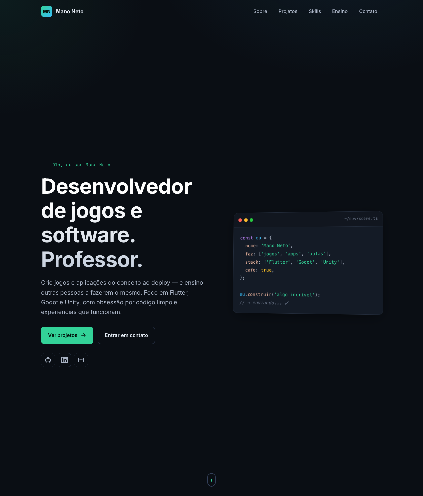

<div align="center">

# omanoloneto.pro

**Portfólio pessoal de [Manolo Neto](https://omanoloneto.pro) — desenvolvedor de jogos & software, e professor.**

[](https://omanoloneto.pro)
[](https://astro.build)
[](https://www.typescriptlang.org/)
[](LICENSE)

<a href="https://omanoloneto.pro"></a>

</div>

---

## ✨ Sobre

Duas coisas num site só, construído com **Astro** — HTML estático que roda em qualquer
hospedagem de arquivos:

1. **Home** (`/`) — cartão de visitas tipográfico, tema dark.
2. **Sala de aula** (`/class`) — hub de jogos educativos e simuladores gratuitos,
   em português, feitos pra sala de aula (tema claro, estilo "grade de apps").

### Funcionalidades

- 🎮 **Jogos educativos** — Trem de Palavras (sílabas) e Letras Espaciais (teclado), com botão de tela cheia
- 🖥️ **Simulador do Windows 98** — história da computação pra crianças
- 👩‍🏫 **Guia pra professores** — `/class/professores`: série indicada, como usar em aula
- 📴 **PWA / offline** — a sala de aula funciona sem internet depois da primeira visita (service worker + manifest)
- 🌑 **Tema dark** na home com design tokens próprios (sem framework de CSS)
- ⚡ **Fontes self-hosted** — Inter + JetBrains Mono em woff2 local; as páginas `/class` usam fontes de sistema (zero download)
- 🔍 **SEO** — Open Graph com imagens 1200×630, JSON-LD (Person, VideoGame, LearningResource), canonical, `sitemap.xml`, `robots.txt`
- ♿ **Acessível** — skip-link, foco visível, HTML semântico, `prefers-reduced-motion`
- 🚧 **404 própria** + `.htaccess` com cache de assets
- 🚀 **Deploy via FTP** em um comando

---

## 🛠️ Stack

| Camada | Tecnologia |
|--------|------------|
| Framework | [Astro 7](https://astro.build) (static output) |
| Linguagem | TypeScript (strict) |
| Estilo | CSS puro + design tokens (`:root`) |
| SEO | `@astrojs/sitemap` + JSON-LD + Open Graph |
| Fontes | Inter + JetBrains Mono (self-hosted, `public/fonts/`) |
| Offline | Service worker + webmanifest (`public/class/`) |
| Deploy | FTP (`curl`) |

---

## 🚀 Começando

Pré-requisito: [Node.js](https://nodejs.org) 18+.

```bash
git clone https://github.com/omanoloneto/omanoloneto.pro.git
cd omanoloneto.pro
npm install
npm run dev          # http://localhost:4321
```

### Scripts

| Comando | O que faz |
|---------|-----------|
| `npm run dev` | Servidor de desenvolvimento (hot reload) |
| `npm run build` | Gera o site estático em `dist/` |
| `npm run preview` | Serve o `dist/` localmente (igual produção) |
| `./deploy.sh` | Build + upload via FTP |

---

## 📁 Estrutura

```
src/
├─ data/
│  ├─ site.ts               # nome, bio, email, redes sociais
│  ├─ trem-de-palavras.ts   # palavras/níveis do jogo
│  └─ letras-espaciais.ts   # níveis do jogo
├─ components/
│  └─ Icon.astro            # ícones SVG inline
├─ layouts/
│  └─ Layout.astro          # <head>, SEO/OG/JSON-LD, fontes, PWA, reveal
├─ pages/
│  ├─ index.astro           # home (cartão de visitas)
│  ├─ 404.astro             # página de erro
│  └─ class/                # sala de aula: hub, jogos, simuladores, guia
└─ styles/
   └─ global.css            # design tokens, reset, utilitários
public/
├─ fonts/                   # woff2 self-hosted + fonts.css
├─ og/                      # imagens Open Graph 1200×630
├─ class/                   # manifest.webmanifest, sw.js, ícones dos jogos
└─ .htaccess                # 404 + cache (Hostinger/Apache)
```

### Onde editar o conteúdo

| O quê | Arquivo |
|-------|---------|
| Nome, bio, email, redes | [`src/data/site.ts`](src/data/site.ts) |
| Palavras / níveis dos jogos | [`src/data/trem-de-palavras.ts`](src/data/trem-de-palavras.ts), [`src/data/letras-espaciais.ts`](src/data/letras-espaciais.ts) |
| Jogos e simuladores novos | `src/pages/class/…` (e inclua no precache de [`public/class/sw.js`](public/class/sw.js)) |
| Cores / fontes / tema | [`src/styles/global.css`](src/styles/global.css) (bloco `:root`) |

> Mudou algo relevante em `/class`? Suba a versão do cache no topo de
> [`public/class/sw.js`](public/class/sw.js) (`class-v1` → `class-v2`) pra
> forçar a atualização em quem já tem o site offline.

---

## 📦 Deploy

A saída em `dist/` é estática — sobe em qualquer host (FTP, GitHub Pages, Vercel, Netlify…).

### FTP (configuração atual)

```bash
cp .env.example .env       # preencha as credenciais (o .env é ignorado pelo git)
./deploy.sh                # build + upload
```

O `deploy.sh` lê as variáveis de `.env` (ou do ambiente) e nunca guarda segredos no repositório.
A pasta pública neste host (Hostinger) é `domains/<dominio>/public_html/`.

> Antes de publicar em outro domínio, ajuste `site:` em [`astro.config.mjs`](astro.config.mjs)
> (afeta canonical e sitemap).

---

## 📄 Licença

[MIT](LICENSE) © Manolo Neto
